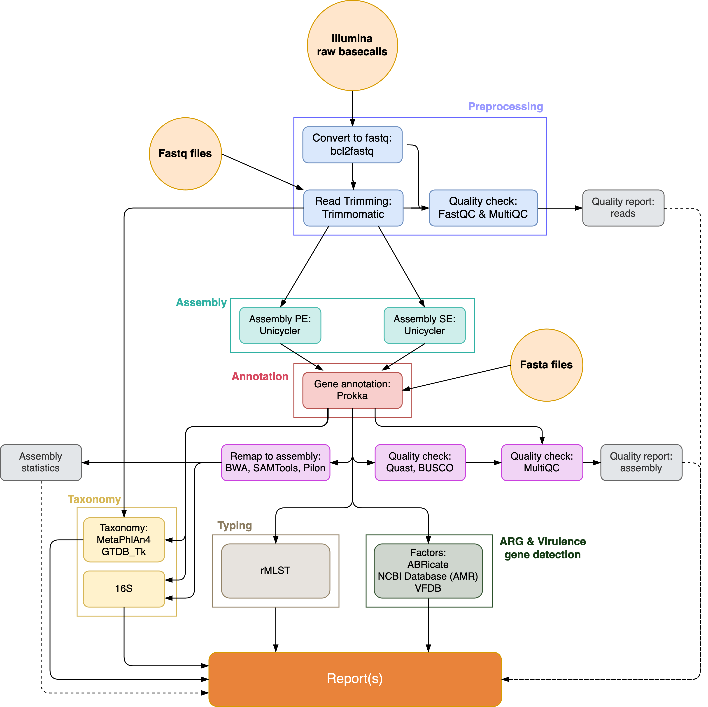
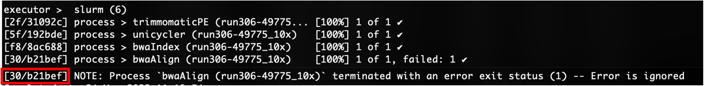
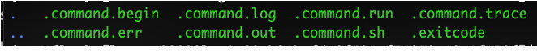
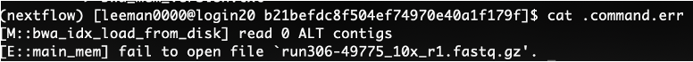

# IMMense

IMM Extended Nextflow Sequencing Environment

[](/pics/IMMense_logo_black.jpg)

<sub>Logo by Paola Dellea (https://www.paoladellea.art/)</sub>

[]([https://www.nextflow.io/])

## Author

* Michèle Leemann, Marco Meola
* Updated/extended by Philipp v. Bieberstein
* developed and maintained by Vanni Benvenga (vbenvenga@imm.uzh.ch)

Institution: Applied Microbiology Research - Institute of Medical Microbiology - University of Zurich (UZH)

The steps that are included are:

* Preprocessing
	* Trimmomatic (0.39)
* Pre-Assembly QC
	* FastQC (0.12.1)
	* MultiQC (1.23)
* Assembly
	* Unicycler (0.5.0)
* Post-Assembly QC
	* Quast (5.0.2)
	* GenomeQC - BUSCO (5.3.2)
	* CheckM (1.2.2)
* Taxonomy
	* GTDB-tk (2.3.2)
	* Metaphlan4 (4.1.0)
	* 16S blastn (2.12.0+)
	* rMLST blastn (2.11.0+)
	* pyMLST (2.1.6)
* Genome annotation
	* Bakta (1.9.3)
* Genome inspection (antimicrobial resistance genes, virulence factors)
	* abricate (1.0.1)
	* NCBI-AMRfinderplus (3.12.8)

[](IMMENSE_diagram.png)

# Table of contents

* [Introduction](#Introduction)
* [Quickstart](#Quickstart)
	* [Running the pipeline on raw data](#Running-the-pipeline-on-raw-data)
	* [Running the pipeline on fastq files](#Running-the-pipeline-on-fastq-files)
	* [Running the pipeline on single fastq file(s)](#Running-the-pipeline-on-single-fastq-file(s))
	* [Running the pipeline on fasta files](#Running-the-pipeline-on-fasta-files)
	* [Email-notification](#Email-notification)
	* [Change parameters for Trimmomatic](#Change-parameters-for-Trimmomatic)
	* [Troubleshooting](#Troubleshooting)
		* [Additional samples](#Additional-samples)
		* [Inspecting failed processes](#Inspecting-failed-processes)

* [Preparations for usage on other infrastructure](#Requirements)
	* [Requirements](#Requirements)
	* [Installing the required databases](#Download-Singular-containers)
	* [Creating a new config profile for my infrastructure](#Adjusting-the-Config-files)
	* [Launching the pipeline](#Quickstart)
		
<a name="Introduction"></a>

# Introduction

IMMense is a nextflow pipeline. Information about Nextflow can be found under https://www.nextflow.io/ and in the [Nextflow documentation](https://www.nextflow.io/docs/latest/index.html).   

The workflow of the pipeline is defined in the **main.nf** file. The underlying processes are defined in the **modules** of each tool. The configuration for the usage of the containers (Singularity) and the resource management for the executor (SLURM) are defined in the config files **nextflow.config** (for general settings) and **conf/profiles/*.config** for infrastructure specific settings. The infrastructure-specific profiles define where the locations of the required databases are on that system.

Each process of the pipeline has its own working directory that is located in the **work** folder, where all the output and log files for each process are stored. The favoured output files are copied to the results folder and therefore the **work directory can be removed if the results are satisfactory**. Otherwise this **work** directory is needed to resume the pipeline after making changes.

While the pipeline is running the status can be monitored in **.nextflow.log** or in the slurm file. With successful completion the **report.html**, **timeline.html** and **trace.txt** files are produced which give information about each process including the used ressources. 

>**NOTE:** To run IMMense on a SLURM cluster, the `run_IMMENSE.sh` will submit a SLURM job which will start the nextflow pipeline. If you run IMMENSE locally on a computer, you will directly launch the nextflow pipeline with `nextflow run main.nf ...`

<a name="Quickstart"></a>

## Quickstart

> Make sure all the required databases and software is installed: [Requirements](#Requirements)

### Download the Pipeline

To download a specific version (ie. version v1.1.1 validated within UZH), download the v1.1.1 branch
```{bash}

git clone -b v1.1.1 https://gitlab.uzh.ch/appliedmicrobiologyresearch/amr_research/immense.git immense_v1.1.1
```

Alternatively, to download the latest development version, download the master branch:
```{bash}
git clone https://gitlab.uzh.ch/appliedmicrobiologyresearch/amr_research/immense.git immense
```

### SLURM Cluster (ie. S3IT)

For SLURM-systems the launching of the pipeline is handled by the bash script `run_IMMENSE.sh`. 

```
# By default the output is always written in the current directory
cd /directory/where/you/want/output
bash /path/to/IMMENSE/run_IMMENSE.sh -j test_run -t fq_PE -r test_run -i /path/to/IMMENSE/data/test_dataset
```

>**Arguments**
>- `-j` job name for SLURM
>- `-t` mode type for pipeline (fq_PE, fq_SE, fasta, raw_SE, raw_PE)
>- `-r` run name for output directory and filenames
>- `-i` path to input data
>- `-x "<OPTIONAL ARGUMENTS>"` additional arguments in quotes that are passed to be pipeline, see optional argument options below
>- *Output will be saved in your current working directory*

### Locally on Linux  (ie. IMM server)

To run the pipeline directly without SLURM, the general command to launch the pipeline locally is: 

```
# Make sure you specify a `profile` that works with your infrastructure or create a new one in `conf/profiles/`

nextflow run /path/to/IMMENSE/main.nf -profile <profile-name> --run_id <run_name> --input_type fastq/bcl/fasta --input /path/to/IMMENSE/data/test_dataset --SE YES/NO

# For example:
nextflow run /path/to/IMMENSE/main.nf -profile imm --run_id test_run --input_type fastq --input /path/to/IMMENSE/data/test_dataset --SE NO
```

>**Arguments**
>- -profile	Name of the executer profile defined in `conf/profiles` directory
>- --run_id	`Name of the run`
>- --input_type	Type of the input data: `bcl (for raw data), fastq, or fasta`
>- --input		`Path to the input data`
>- --SE		Single-end reads: `YES or NO`
>  
> **OPTIONAL ARGUMENTS:**
>- --single_sample `<NAME_OF_SAMPLE>`
>- --trimmomatic_PE_extra `<SLIDINGWINDOW:4:12 MINLEN:100>`
>- --trimmomatic_SE_extra `<SLIDINGWINDOW:4:12 MINLEN:70>`
>- --email `<your@email.address>`
>- --output_dir_sample `<Where sample specific results should be saved>`
>- --output_dir_run `<Where run summary files should be saved>`
>- --skip_gtdb `skips gtdb process`
>- --skip_checkm `skips checkM process`
>- --skip_busco `skips BUSCO process`
>- --skip_wgmlst `skips wgMLST (pyMLST) process`
>- --skip_lissero `skips lisSero process`


The **additional options** as described for the usage on S3IT can be added in the same manner to the command and all parameters defined in the params.config file can be overwritten on the command line with `--<parames-name> <params-value>`.


# Detailed running IMMense on S3IT (UZH SLURM cluster)

>The pipeline can be run on **raw BCL data**, **fastq files**, or **fasta files**. By default, the output and work directory is saved in the current working directory (can be changed in infrastructure-specific profiles).

The general command to run the pipeline on a SLURM cluster:

```
# Go to directory where you want to save your output
cd where/you/want/your/output

# Start Pipeline
bash path/to/pipeline/run_IMMENSE.sh -j <SLURM_JOB_NAME> -t <input_type> -r <run_id> -i </absolute_path/to/input> -x "<additional_options>"
```

**SLURM_JOB_NAME**: Job name for the SLURM job name

**input_type**: raw_PE, raw_SE, fq_PE, fq_SE, or fasta

**run_id**: the transfer folder, the quality file, and the software version file will be tagged with the run_id.

**"additional_options"**: is optional and is used for specifying single samples, email address, or different parameters for trimmomatic. Several additional options can be combined by listing them one after the other inside double quotes (```"option1 option2 ... "```). 

>After completion of the pipeline and if everything is ok, you can free disk space by **removing the work folder**.

The general command to run the pipeline locally:

>**NOTE:** For local run, the `--input_type` is one of: [fasta, fastq, bcl] and the `--SE` is one of[YES, NO] which specifies single-end (YES) or paired-end (NO).

```
nextflow run /path/to/IMMENSE/main.nf -profile <configuration-profile-name> --run_id <run_id> --input_type <input_type> --input /path/to/IMMENSE/data/test_dataset --SE <YES/NO>
```

## Running the pipeline on raw data

Depending on the data use **raw_PE** or **raw_SE** for the **input_type**:  

* **raw_PE** &nbsp; &nbsp; &nbsp; &nbsp; for raw data of paired-end reads  
* **raw_SE** &nbsp; &nbsp; &nbsp; &nbsp; for raw data of single-end reads

Provide the absolute path to where the **samplesheet** and the **data** is located, for example  
``` 
/scicore/home/egliadr/GROUP/runQC/run500/demultiplexing 
``` 

Example command for analysing the raw paired-end data of run500:  

``` 
bash path/to/pipeline/run_IMMENSE.sh -j IMMENSE_run500 -t raw_PE -r run500 -i /scicore/home/egliadr/GROUP/runQC/run500/demultiplexing
```
To run locally or on IMM cluster, the nextflow script is started directly without the *run_IMMENSE.sh* script:

> NOTE: Use **tmux** sessions so that the pipeline continues running even if you disconnect your terminal session.

```
# Use tmux so you can close the command line but keep the job running (RECOMMENDED)
tmux

nextflow run /path/to/IMMENSE/main.nf -profile imm --run_id run500 --input_type fastq --input /path/to/IMMENSE/data/test_dataset --SE NO

# Later you can re-enter the tmux session by 
tmux a -t 0 
# Or replace 0 with your session-ID if you have multiple tmux sessions

```
>**Note**: There must be no quotes around the paths.

## Running the pipeline on fastq files

Depending on the reads use **fq_PE** or **fq_SE** for the **input_type**:  

* **fq_PE** &nbsp; &nbsp; &nbsp; &nbsp; for paired-end reads 
* **fq_SE** &nbsp; &nbsp; &nbsp; &nbsp; for single-end reads

Provide the absolute path to the **"reads" folder**, for example 
``` 
/shares/amr.imm.uzh/data/illumina/routine/runQC/run500/reads 
```  
or for a single species
``` 
/shares/amr.imm.uzh/data/illumina/routine/run500/reads/esccol 
``` 
> The pipeline uses the parent directory name that contains the *fastq.gz* files as the predicted species name. If you don't follow this convention, the expected species will be meaningless but everything should still work.

Example command for analysing the paired-end reads of run500:  

``` 
bash path/to/pipeline/run_IMMENSE.sh -j IMMENSE_run500 -t fq_PE -r run500 -i /scicore/home/egliadr/GROUP/runQC/run500/reads
``` 
**Note**: There must be no quotes around the paths.

## Running the pipeline on single fastq file(s)

It is possible to run one or several single samples out of the reads folder. 

For **one single sample** add ```"--single_sample <sample_id>"``` with the `-x` flag in the bash command (i.e. **"additional_options"**).

Example to run one **single sample**: 
``` 
bash path/to/pipeline/run_IMMENSE.sh -j IMMENSE_singleSample -t fq_PE -r run_singleSample -i /scicore/home/egliadr/GROUP/runQC/IMMENSETestHSS/reads/pseaer -x "--single_sample 401915-22"
``` 

For **several individual samples** add a prefix that defines all of them```"--single_sample sample_id_1"``` to match sample_id_1, sample_id_11, etc. at the end of the bash command (i.e. **"additional_options"**).

Example to run **three samples**:
``` 
bash path/to/pipeline/run_IMMENSE.sh -j IMMENSE_threeSamples -t fq_PE -r run_threeSamples -i /scicore/home/egliadr/GROUP/runQC/IMMENSETestHSS/reads -x "--single_sample {401915-22,502637-1-21,202315-22}"
``` 
## Running the pipeline on fasta files

To run the pipeline on fasta files provide a directory with the genome files to be run. Allowed endings are ```.fasta``` or ```.fna```. 

The **input_type** to be used is **fasta**.

``` 
bash path/to/pipeline/run_IMMENSE.sh -j IMMENSE_genomes -t fasta -r run_genomes -i /S3IT/home/egliadr/GROUP/Michele/example_genomes
``` 

## Email-notification

To receive an email notification when the pipeline is finished including multiqc files and the quality file use  
```"--email <email_address1,email_address2,...>"``` at the end of the sbatch command (i.e. **"additional_options"**). Or specify the email address in the infrastructure specifc config profile with the *email parameter*.

``` 
bash path/to/pipeline/run_IMMENSE.sh -j IMMENSE_run500 -t raw_PE -r run500 -i /scicore/home/egliadr/GROUP/runQC/run500/demultiplexing -x "--email username@imm.uzh.ch"

```

You can also use it in combination with the single_sample option:

``` 
bash path/to/pipeline/run_IMMENSE.sh -j IMMENSE_run500 -t raw_PE -r run500 -i /scicore/home/egliadr/GROUP/runQC/run500/demultiplexing -x "--single_sample {sample_id_1,sample_id_2,...,sample_id_X} --email username@imm.uzh.ch"
``` 

## Change parameters for Trimmomatic

The default values for Trimmomatic are:

* **Paired-end reads**: SLIDINGWINDOW:4:12 MINLEN:100
* **Single-end reads**: SLIDINGWINDOW:4:12 MINLEN:70

To change one of the values use the **"additional_options"** argument, for example:  

&nbsp; &nbsp; &nbsp; &nbsp; **Paired-end reads**: ```"--trimmomatic_PE_extra SLIDINGWINDOW:4:12 MINLEN:80"```  

&nbsp; &nbsp; &nbsp; &nbsp; **Single-end reads**: ```"--trimmomatic_SE_extra SLIDINGWINDOW:4:12 MINLEN:50"``` 

Both, SLIDINGWINDOW and MINLEN need to be specified, but also additional trimmomatic options could be included if desired by placing them after the MINLEN argument. 

Full command:

``` 
bash path/to/pipeline/run_IMMENSE.sh -j IMMENSE_run500 -t raw_PE -r run500 -i /scicore/home/egliadr/GROUP/runQC/run500/demultiplexing -x "--trimmomatic_PE_extra SLIDINGWINDOW:4:12 MINLEN:80"
```

## Troubleshooting

### Lacking Write permission

If you receive this error when starting the pipeline:
```
ERROR ~ .nextflow/history.lock (No such file or directory)

 -- Check '.nextflow.log' file for details
```
Then this usually means you don't have permission to write into your current working directory. Add write permissions to current working directory with `sudo chmod 777 .`


### Additional samples

If there are additional samples for a run or samples need to be re-run just re-start the pipeline again.It may help to use a different **run_id**, for example ```run500_2``` so that you know which results have been updated.

The results for the samples will be added to ```assembly/results``` and the transfer_folder will either update or a new one will be created if you change the **run_id**.

If the same **run_id** is used, the existing quality and software version files will get overwritten. 

### Inspecting failed processes

In the slurm file all processes run in the pipeline are visible. If a job fails, the exit status is displayed. 

>**NOTE:** The `trace.txt` file can be esspecially helpful to see which processes failed and what their *work* directory is.

[](pics/slurm_fail.png)

The cause of the error can be reviewed in the working directory of the process which is ```work/<hash_id>``` of the process. For the above example ```work/30/b21bef...```

Besides input and output files, the working directory of each process has the following hidden files:

[](pics/command_files.png)

The `.command.sh` file shows the command that was run in the process, and the `.command.err` the error that caused the failing of the process.

[](pics/error.png)

Often the `.command.log` or the `.command.out` file can give further information about the problem. 

The hidden `.nextflow.log` file in the main working directory also has a lot of helpful information for debugging.

<a name="Requirements"></a>

# Requirements

>Follow these instructions to run IMMense on other infrastructure

### Install Dependencies

Clone IMMense repository.

```
git clone https://gitlab.uzh.ch/appliedmicrobiologyresearch/immense.git
```

Install [miniconda](https://conda.io/projects/conda/en/latest/user-guide/install/index.html). Then, for SLURM clusters with `module load` functionality, the `run_IMMENSE.sh` script automatically checks if you have all dependencies installed and if not installs them based on `environment.yml`. 

Alternatively, if you're on a server without SLURM, manually use the `environment.yml` file to install the dependencies after installing [miniconda](https://conda.io/projects/conda/en/latest/user-guide/install/index.html):

```
cd path/to/IMMENSE_repo
conda env create -f environment.yml
# This creates a conda environment called `env_immense` which can be activated by:
# conda activate env_immense
```

### Adjusting the Config files

Global configurations are set in `nextflow.config` (should not need changing) and infrastructure specific configurations are specified in config "profiles" in the `conf/profiles` directory.

To run on UZH's S3IT cluster, we use the `s3it.config`. To run locally on the IMM cluster without SLURM we use the `imm.config`. These are specified using: `-profile s3it` or `-profile imm` in the `nextflow run` command.

To run the pipeline somewhere else (or if the setup changes) create a new "profile" by copying one of the existing `.config` files and changing the profile name and the **database paths** and any other settings you need. If using the `run_IMMENSE.sh` script to submit the pipeline to the SLURM scheduler, also update the `-profile` argument in the `bin/submit_to_cluster.sh` script which contains the nextflow command.


### Download Singular containers
Get all the required singularity images. Either locally or by starting an interactive SLURM session if you're on a cluster: (login node will run out of memory)

```
srun --pty -n 1 -c 6 --time=01:00:00 --mem=16G bash -l
```

Then loading singularity and using the script in the repo to load all the container images to the location where they should be saved. You supply the path to the script as the only argument. This must match with your path in `conf/profiles/<your-profile>.config`

```
conda activate env_immense

# Navigate to the pipeline repository
cd path/to/IMMENSE_repo

# Then run the script to pull all the container images to the directory you specify
bash Singularity/pull_singularity_img.sh <path/to/directory/singularity_images_cache>
```

### Prepare required Databases

Adjust the paths in the infrastructure specific `.config` files to location of the different databases/files. 

The following databases/files are required (see below how to install/download):

* Metaphlan4 database
* BUSCO database
* GTDB 
* 16S database
* rMLST database
* cgMLST database
* QC Rules
* AMRfinderplus database
* Bakta Database
* checkM

### Prepare required Databases

#### metaphlan4

```{bash}
# Put the metaphlan4 database where you want and update path in params.config

# The easiest way to download metaphlan4 database is to use metaphlan4 (depending on your system you may have to start an interactive SLURM session)

conda activate env_immense

singularity shell path/to/singularity/containers/quay.io-biocontainers-metaphlan-4.1.0--pyhca03a8a_0.img 

cd path/to/immense_dependencies/metaphlan4/database # where you want the database to exist

# To download the June 2023 database use the following command
metaphlan --bowtie2db mpa_vJun23_CHOCOPhlAnSGB_202307 --install
```

#### BUSCO

```{bash}
singularity shell path/to/immense_dependencies/singularity/ezlabgva-busco_v5.3.2_cv1.img
busco --download --download_path /path/to/immense_dependencies/busco_downloads
```

#### GTDBtk

```{bash}
# To download the GTDBtk r207v2 dataset we used the following paths
mkdir -p /path/to/immense_dependencies/gtdb/gtdbtk_r207_v2
cd /path/to/immense_dependencies/gtdb/gtdbtk_r207_v2

wget https://data.ace.uq.edu.au/public/gtdb/data/releases/release207/207.0/auxillary_files/gtdbtk_r207_v2_data.tar.gz

# Alternative mirror if the first url is too slow: https://data.gtdb.ecogenomic.org/releases/release207/207.0/auxillary_files/gtdbtk_r207_v2_data.tar.gz

# Unpack the dataset:
tar xvzf gtdbtk_r207_v2_data.tar.gz
```

#### NCBI 16S Database:

```{bash}
mkdir -p /path/to/immense_dependencies/BLAST/16S_ribosomal_RNA
cd /path/to/immense_dependencies/BLAST/16S_ribosomal_RNA

# Download it from https://ftp.ncbi.nlm.nih.gov/blast/db/
wget https://ftp.ncbi.nlm.nih.gov/blast/db/16S_ribosomal_RNA.tar.gz

# Unpack it
tar -xzvf 16S_ribosomal_RNA.tar.gz
```

#### Download rMLST Database:

For this you need an account at [https://pubmlst.org/bigsdb](https://pubmlst.org/bigsdb):
1. Make an account
2. Request access to the entire dataset under *MY ACCOUNT*: `Ribosomal MLST genomes (pubmlst_rmlst_isolates)` and `Ribosomal MLST typing (pubmlst_rmlst_seqdef)`
3. Go to *SPECIES ID* in the menu and then the *Typing* link. [Link to Tab](https://pubmlst.org/bigsdb?db=pubmlst_rmlst_seqdef)
4. On the right under *DOWNLOADS* section, right click on *Ribosomal MLST profiles* and save-link-as. This file refers to the `bigsdb_rMLST` path in the config file.
> Downloading with command line is not possible because it needs authentication
5. Download all Sequences by clicking *Allele Sequence* then expand the *Typing* tree selector and click *Ribosomal MLST*. On the bottom you will see the option to download each Sequence file from `BACT000001 (rpsA)` to `BACT000065 (rpmJ)`. Download each of them and save all fasta files together with the *Ribosomal MLST profiles* file (Step 4) in the same directory and move to wherever you want to store this database. This path should be added as `db_rMLST` variable in your config profile under `conf/profiles/`. And the path to the specific `Ribosomal MLST profiles` text file is added as `bigsdb_rMLST` variable.

```{bash}
# Making tar archive to compress files and send to server where IMMense will run
tar -zcvf bigrMLST.tar.gz directory_to_compress/

# Sending over to server
rsync -az --progress bigrMLST.tar.gz "<USERNAME>@<SERVER_NAME>:/path/to/immense_dependencies/rMLST/"

# Unpacking the archive:
tar -xzvf bigrMLST.tar.gz

# If you compressed on a Mac and extract in linux, you may get some warning such as:
--------
MLST/._BACT000017.fas
tar: Ignoring unknown extended header keyword 'LIBARCHIVE.xattr.com.apple.quarantine'
tar: Ignoring unknown extended header keyword 'LIBARCHIVE.xattr.com.apple.metadata:kMDItemWhereFroms'
tar: Ignoring unknown extended header keyword 'LIBARCHIVE.xattr.com.apple.macl'
MLST/BACT000017.fas
--------

# You can ignore these and remove all the ._... files created by running:
`rm ._*` in the directory

```

6. Create blastn databases from each fasta file

Create blastn database using the blast singularity image (or use your local blast installation if you have it)

```{bash}
conda activate env_immense

cd path/to/extracted/rMLST/files

# Mount the current directory to `/mnt` inside the singularity container
singularity shell --bind $(pwd):/mnt path/to/singularity/containers/quay.io-biocontainers-blast-2.14.1--pl5321h6f7f691_0.img

cd /mnt/database_directory

# Create the blastn database for each rMLST `.fas` file by using the provided script
bash directory/to/immense/pipeline/bin/make_MLST_blast_database.sh .

# Exit the singularity container
exit

# Now you should have these file extensions for each of the .fas files:
#fas.nin
#fas.ntf
#fas.ndb
#fas.not
#fas.nto
#fas.nhr
#fas.nsq
```

This is your ribosomal MLST database. Make sure you link to this directory and the profile.txt file in your profile config file `conf/profiles`

#### cgMLST

You need to create the directory that you specify in your *config profile* for the `pymlst_cgmlst_db` path. The Species-specific cgMLST profiles are then downloaded during the analysis as needed (based on rMLST results).

If you need to run the pipeline in offline environments, you can download the profiles beforehand as follows:
To download cgMLST profiles, we use pyMLST to get the newest profiles from [https://www.cgmlst.org](https://www.cgmlst.org/ncs)

```{bash}
#NOTE: Replace </path/to/immense_dependencies> to the path where all your dependencies are stored.

# Start the pyMLST singularity container that you downloaded before and bind necessary paths:
singularity shell --bind </path/to/immense_dependencies>:</path/to/immense_dependencies> </path/to/immense_dependencies>/singularity/quay.io-biocontainers-pymlst-2.1.6--pyhdfd78af_0.img

# Use `wgMLST import` to download each species
# For example:
wgMLST import "/path/to/immense_dependencies/pyMLST/cgMLST/Acinetobacter baumannii" Acinetobacter baumannii

# You can see all available schemas here: https://www.cgmlst.org/ncs
```

> Repeat for all species that you need, check cgmlst.org for which species a 
> profile exists or leave out the Species and you'll be prompted about which 
> Species to download

#### QC Module

Comparing the results to specified metrics to decide if results PASS, FAIL or 

```{bash}
cd </path/to/immense_dependencies>
git clone https://gitlab.sib.swiss/clinbio/spsp-ng/spsp-ng-bioinformatics/pipelines/qc/ngs-bacteria QC_bacteria
#TODO: This repository URL might change in the future

# Then include this path for the `quality_rules` parameter in the config file for your profile under conf/profiles

```

#### AMRfinderplus database

```{bash}
# Activate conda environment so you have access to singularity
conda activate env_immense

# Navigate to where you want the database to be stored & run amrfinderplus interactively
cd <Path/to/IMMense_dependencies/AMRfinderplus>

singularity shell --bind $(pwd):/mnt <Path/to/IMMense_dependencies/singularity>/quay.io-biocontainers-ncbi-amrfinderplus-3.12.8--h283d18e_0.img

# Navigate to /mnt because that mirrors the current working directory from where you launched the container
cd /mnt

# Download the newest database to this directory:
amrfinder_update --force_update --database .

# Look at folder structure, it will create a "YYY-MM-DD" & "latest" directory, 
# Decide which one you want to use and update path in your config profile.
ls
```

#### Bakta Database

```{bash}
# Navigate to where you want the database to be stored & run amrfinderplus interactively
cd <Path/to/IMMense_dependencies/bakta>

singularity shell --bind $(pwd):/mnt <Path/to/IMMense_dependencies/singularity>/quay.io-biocontainers-bakta-1.9.3--pyhdfd78af_0.img

cd /mnt
bakta_db download --output . --type full

```

Pat yourself on the shoulder if you made it this far. 🥳 

## Developing

This repository follows the [trunk-based development methodolgy](https://trunkbaseddevelopment.com/) to working with Git. The master branch is continously developed on and should always be in a working state with the newest features. A specific release is published as it's own branch with a version number (such as v1.1.1) so that it can be validated and frozen in time (only urgent bugfixes should be published to these release branches).


## License

[GNU General Public License, version 3](https://www.gnu.org/licenses/gpl-3.0.html)