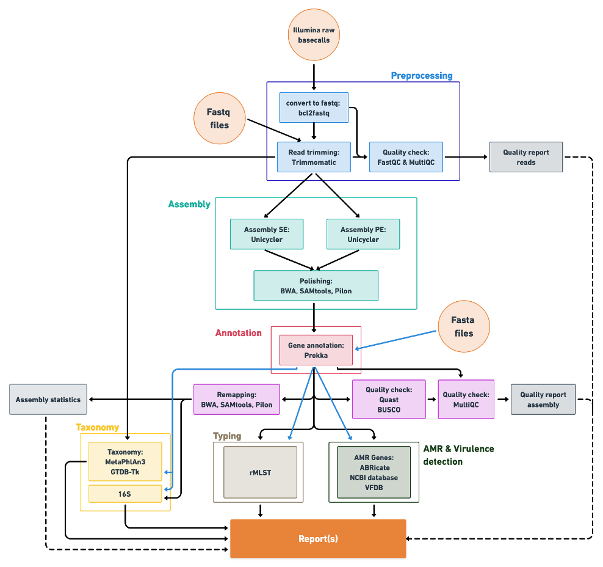
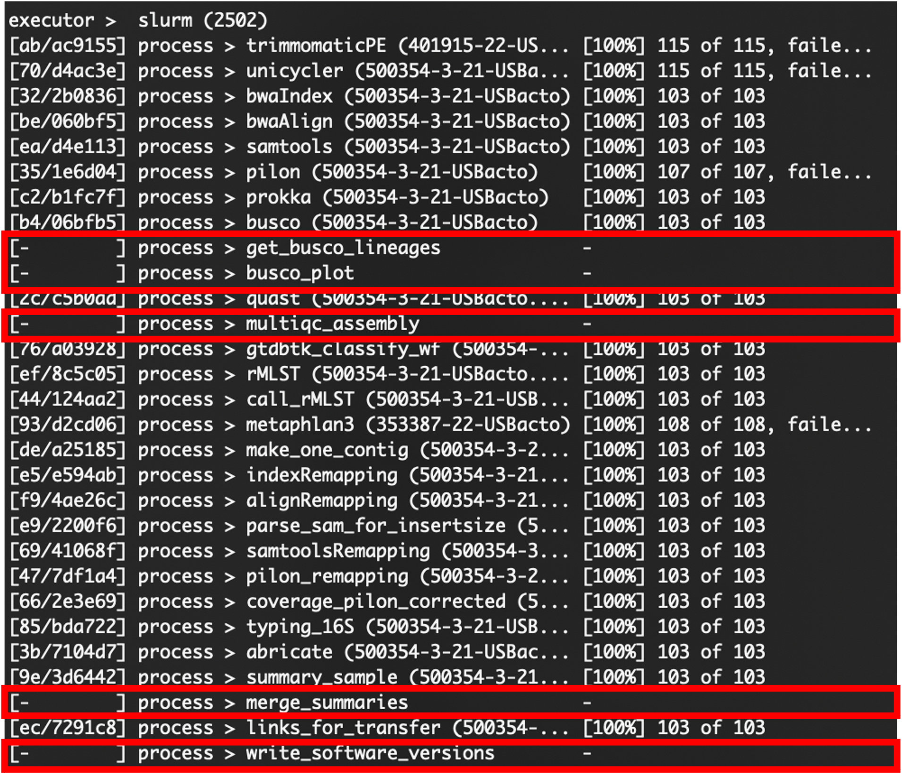

# IMMENSE

IMM Extended Nextflow Sequencing Environment

[]([https://www.nextflow.io/])

## Author

* Michèle Leemann and Marco Meola (mmeola@imm.uzh.ch)

Institution: Applied Microbiology Research - Institute of Medical Microbiology - University of Zurich (UZH)

The steps that are included are:

* Preprocessing
	* Trimmomatic (0.39)
* Pre-Assembly QC
	* MultiQC (1.11)
* Assembly
	* Unicycler (0.4.8)
* Post-Assembly QC
	* Quast (5.0.2)
	* GenomeQC - BUSCO (5.3.2)
* Taxonomy
	* GTDB-tk1 (2.1.0)
	* Metaphlan4 (4.1.0)
* Genome annotation
	* Prokka (1.14.6)
* Genome inspection (antimicrobial resistance genes, virulence factors)
	* abricate (1.0.1)

[](dag.png)

# Table of contents

* [Introduction](#Introduction)
* [Running IMMENSE on S3IT](#Running-IMMENSE-on-S3IT)
	* [Running the pipeline on raw data](#Running-the-pipeline-on-raw-data)
	* [Running the pipeline on fastq files](#Running-the-pipeline-on-fastq-files)
	* [Running the pipeline on single fastq file(s)](#Running-the-pipeline-on-single-fastq-file(s))
	* [Running the pipeline on fasta files](#Running-the-pipeline-on-fasta-files)
	* [Email-notification](#Email-notification)
	* [Change parameters for Trimmomatic](#Change-parameters-for-Trimmomatic)
	* [Troubleshooting](#Troubleshooting)
		* [Additional samples](#Additional-samples)
		* [Inspecting failed processes](#Inspecting-failed-processes)
		* [Pipeline does not finish / Missing quality files](#Pipeline-does-not-finish-/-Missing-quality-files)

* [Preparations for usage on other infrastructure](#Preparations-for-usage-on-other-infrastructure)
	* [Requirements](#Requirements)
	* [Adjusting the nextflow.config file](#Adjusting-the-nextflow.config-file)
	* [Adjusting the params.config file](#Adjusting-the-params.config-file)
	* [Launching the pipeline](#Launching-the-pipeline)
		

# Introduction

IMMENSE is a nextflow pipeline. Information about Nextflow can be found under https://www.nextflow.io/ and in the [Nextflow documentation](https://www.nextflow.io/docs/latest/index.html).   

The workflow of the pipeline is defined in the **main.nf** file. The underlying processes are defined in the **modules** of each tool. The configuration for the usage of the containers (Singularity) and the ressource management for the executor (SLURM) are defined in the **nextflow.config** file. The locations of the required databases and default values are specified in the **params.config** file. 

Each process of the pipeline has its own working directory that is located in the **work** folder, where all the output and log files for each process are stored. The favoured output files are copied to the results folder and therefore it is useful to **remove the work directory** if the pipeline finished satisfactorily.  

While the pipeline is running the status can be monitored in **.nextflow.log** or in the slurm file. With successful completion the **report.html** is produced which gives information about each process inlcuding the used ressources. 

# Running IMMENSE on S3IT

The pipeline can be run on **raw data**, **fastq files**, or **fasta files**.

The general command to run the pipeline is:

```
# Go to directory where you want to save your output
cd where/you/want/your/output

# Start Pipeline
bash path/to/pipeline/run_IMMENSE.sh -j <SLURM_JOB_NAME> -t <input_type> -r <run_id> -i </absolute_path/to/input> -x "<additional_options>"
```

**SLURM_JOB_NAME input_type run_id /absolute_path/to/input "additional_options"** must be provided in this order!

**SLURM_JOB_NAME**: Job name for the SLURM job name

**input_type**: raw_PE, raw_SE, fq_PE, fq_SE, or fasta

**run_id**: the transfer folder, the quality file, and the software version file will be tagged with the run_id.

**"additional_options"**: is optional and is used for specifying single samples, email address, or different parameters for trimmomatic. Several additional options can be combined by listing them one after the other inside double quotes (```"option1 option2 ... "```). 

After completion of the pipeline and if everything is ok, it is useful to **remove the work folder**. 

## Running the pipeline on raw data

Depending on the data use **raw_PE** or **raw_SE** for the **input_type**:  

* **raw_PE** &nbsp; &nbsp; &nbsp; &nbsp; for raw data of paired-end reads  
* **raw_SE** &nbsp; &nbsp; &nbsp; &nbsp; for raw data of single-end reads

Provide the absolute path to where the **samplesheet** and the **data** is located, for example  
``` 
/scicore/home/egliadr/GROUP/runQC/run500/demultiplexing 
``` 

Example command for analysing the raw paired-end data of run500:  

``` 
sbatch --job-name=IMMENSE_run500 /shares/amr.imm.uzh/bioinfo/pipelines/IMMENSE/run_IMMENSE.sh raw_PE run500 /scicore/home/egliadr/GROUP/runQC/run500/demultiplexing
```
**Note**: There must be no quotes around the paths.

## Running the pipeline on fastq files

Depending on the reads use **fq_PE** or **fq_SE** for the **input_type**:  

* **fq_PE** &nbsp; &nbsp; &nbsp; &nbsp; for paired-end reads 
* **fq_SE** &nbsp; &nbsp; &nbsp; &nbsp; for single-end reads

Provide the absolute path to the **"reads" folder**, for example 
``` 
/shares/amr.imm.uzh/data/illumina/routine/runQC/run500/reads 
```  
or for a single species
``` 
/shares/amr.imm.uzh/data/illumina/routine/run500/reads/esccol 
``` 

Example command for analysing the paired-end reads of run500:  

``` 
sbatch --job-name=IMMENSE_run500 /shares/amr.imm.uzh/bioinfo/pipelines/IMMENSE/run_IMMENSE.sh fq_PE run500 /scicore/home/egliadr/GROUP/runQC/run500/reads
``` 
**Note**: There must be no quotes around the paths.

## Running the pipeline on single fastq file(s)

It is possible to run one or several single samples out of the reads folder. 

For **one single sample** add ```"--single_sample <sample_id>"``` at the end of the sbatch command (i.e. **"additional_options"**).

Example to run one **single sample**: 
``` 
sbatch --job-name=IMMENSE_singleSample /shares/amr.imm.uzh/bioinfo/pipelines/IMMENSE/run_IMMENSE.sh fq_PE run_singleSample /scicore/home/egliadr/GROUP/runQC/IMMENSETestHSS/reads/pseaer "--single_sample 401915-22"
``` 

For **several individual samples** add ```"--single_sample {sample_id_1,sample_id_2,...,sample_id_X}"``` at the end of the sbatch command (i.e. **"additional_options"**).

Example to run **three samples**:
``` 
sbatch --job-name=IMMENSE_threeSamples /shares/amr.imm.uzh/bioinfo/pipelines/IMMENSE/run_IMMENSE.sh fq_PE run_threeSamples /scicore/home/egliadr/GROUP/runQC/IMMENSETestHSS/reads "--single_sample {401915-22,502637-1-21,202315-22}"
``` 
## Running the pipeline on fasta files

To run the pipeline on fasta files provide a directory with the genome files to be run. Allowed endings are ```.fasta``` or ```.fna```. 

The **input_type** to be used is **fasta**.

``` 
sbatch --job-name=IMMENSE_genomes /shares/amr.imm.uzh/bioinfo/pipelines/IMMENSE/run_IMMENSE.sh fasta run_genomes /S3IT/home/egliadr/GROUP/Michele/example_genomes
``` 

## Email-notification

To receive an email notification when the pipeline is finished including multiqc files and the quality file use  
```"--email <email_address1,email_address2,...>"``` at the end of the sbatch command (i.e. **"additional_options"**).

``` 
sbatch --job-name=IMMENSE_run500 /shares/amr.imm.uzh/bioinfo/pipelines/IMMENSE/run_IMMENSE.sh raw_PE run500 /S3IT/home/egliadr/GROUP/runQC/run500/demultiplexing "--email michele.leemann@unibas.ch"
```

You can also use it in combination with the single_sample option:

``` 
sbatch --job-name=IMMENSE_run500 /shares/amr.imm.uzh/bioinfo/pipelines/IMMENSE/run_IMMENSE.sh fq_PE run_threeSamples /S3IT/home/egliadr/GROUP/runQC/IMMENSETestHSS/reads "--single_sample {sample_id_1,sample_id_2,...,sample_id_X} --email michele.leemann@unibas.ch"
``` 

## Change parameters for Trimmomatic

The default values for Trimmomatic are:

* **Paired-end reads**: SLIDINGWINDOW:4:12 MINLEN:100
* **Single-end reads**: SLIDINGWINDOW:4:12 MINLEN:70

To change one of the values use the **"additional_options"** argument, for example:  

&nbsp; &nbsp; &nbsp; &nbsp; **Paired-end reads**: ```"--trimmomatic_PE_extra SLIDINGWINDOW:4:12 MINLEN:80"```  

&nbsp; &nbsp; &nbsp; &nbsp; **Single-end reads**: ```"--trimmomatic_SE_extra SLIDINGWINDOW:4:12 MINLEN:50"``` 

Both, SLIDINGWINDOW and MINLEN need to be specified, but also additional trimmomatic options could be included if desired by placing them after the MINLEN argument. 

Full command:

``` 
sbatch --job-name=IMMENSE_run500 /shares/amr.imm.uzh/bioinfo/pipelines/IMMENSE/run_IMMENSE.sh raw_PE run500 /S3IT/home/egliadr/GROUP/runQC/run500/demultiplexing "--trimmomatic_PE_extra SLIDINGWINDOW:4:12 MINLEN:80"
```

## Troubleshooting

### Additional samples

If there are additional samples for a run or samples need to be rerun start the pipeline again in the run folder but use a different **run_id**, for example ```run500_2```. 

The results for the samples will be added to ```assembly/results``` and a second transfer folder will be created. 

If the same **run_id** is used, the existing quality and software version files will get overwritten. 

### Inspecting failed processes

In the slurm file all processes run in the pipeline are visible. If a job fails, the exit status is displayed. 

[](pics/slurm_fail.png)

The cause of the error can be reviewed in the working directory of the process which is ```work/<hash_id>``` of the process. For the above example ```work/30/b21bef...```

Besides input and output files, the working directory of each process has the following hidden files:

[](pics/command_files.png)

The **.command.sh** file shows the command that was run in the process, and the **.command.err** the error that caused the failing of the process.

[](pics/error.png)

Sometimes the .command.log or the .command.out file can give further information about the problem. 

### Pipeline does not finish / Missing quality files

If the pipeline does not finish properly due to failed processes that leave input channels open, it can happen that the **BUSCO plot, the MultiQC report for the assembly, the quality file** and the **software version file** are not produced. 

[](pics/missing_jobs.png)

With the following workaround the creation of the **BUSCO plot, the MultiQC report**, and the **quality file** can be triggered for the finished samples. 

```
sbatch pipeline_completion.sh <run_id>
```

The **run_id** needs to be same as used for the run that did not finish. 

For the sample(s) that failed, find out what the problem was and rerun it in single_sample mode with a different **run_id**.

# Preparations for usage on other infrastructure

## Requirements

Install Nextflow either by using Bioconda or curl (for instructions see https://www.nextflow.io/). The pipeline was tested with Nextflow version 21.10.0.

Clone IMMENSE repository.

### Prepare Singular containers
Get all the required singularity images by starting an interactive S3IT session on SLURM: (login node might run out of memory)
```
srun --pty -n 1 -c 5 --time=01:00:00 --mem=16G bash -l
```
Then loading singularity and pulling all the container images to the location where they should be saved.

```
module load singularityce

# Navigate to where the container images should be saved
cd /shares/amr.imm.uzh/.singularity 
# Then run the script to pull all the container images
bash path/to/repo/Singularity/pull_singularity_img.sh # Change this to the path where this repository is located.
```

### Prepare required Databases

```
# Put the metaphlan4 database where you want and update path in params.config
cd path/to/metaphlan4/database
# To download Jun23 database, the following links were used
wget http://cmprod1.cibio.unitn.it/biobakery4/metaphlan_databases/mpa_vJun23_CHOCOPhlAnSGB_202307.tar
wget http://cmprod1.cibio.unitn.it/biobakery4/metaphlan_databases/mpa_vJun23_CHOCOPhlAnSGB_202307.md5
wget http://cmprod1.cibio.unitn.it/biobakery4/metaphlan_databases/mpa_vJun23_CHOCOPhlAnSGB_202307_marker_info.txt.bz2
wget http://cmprod1.cibio.unitn.it/biobakery4/metaphlan_databases/mpa_vJun23_CHOCOPhlAnSGB_202307_species.txt.bz2
# Unpack the database:


```

## Adjusting the nextflow.config file

Change the path of **singularity cacheDir** in the **nextflow.config** file to the path were you stored the singularity images.

If the infrastructure is not based on SLURM, a **new profile** for the given executor needs to be defined.

If the infrastructure is based on SLURM, the **--qos** directive of the processes may be adjusted to the available --qos of the infrastructure. Possibly also other directives need to be adjusted.

## Adjusting the params.config file

Adjust the paths in the params.config file to location of the different databases/files. 

The following databases/files are required:

* Illuminaclip fasta
* BUSCO database
* GTDB 
* rMLST database
* 16S database
* Metaphlan4 database

## Launching the pipeline

For S3IT the launching of the pipeline was defined in the run_IMMENSE.sh (or in the old version run_pipeline.sh respectively). 

The general command to launch the pipeline is: 

```
nextflow run /path/to/IMMENSE/main.nf -with-singularity -with-report -profile <profile-name> --run_id <run_id> --input_type <input_type> --input <input_dir> --SE YES/NO
```

```
-profile	Name of the executer profile defined in the nextflow.config file  

--run_id	Name of the run
--input_type	Type of the input data: bcl (for raw data), fastq, or fasta
--input		Absolute path to the input data
--SE		Single-end reads: YES or NO
```

The **additional options** as described for the usage on S3IT can be added in the same manner to the command and all parameters defined in the params.config file can be overwritten on the command line with ```--<parames-name> <params-value>```.
